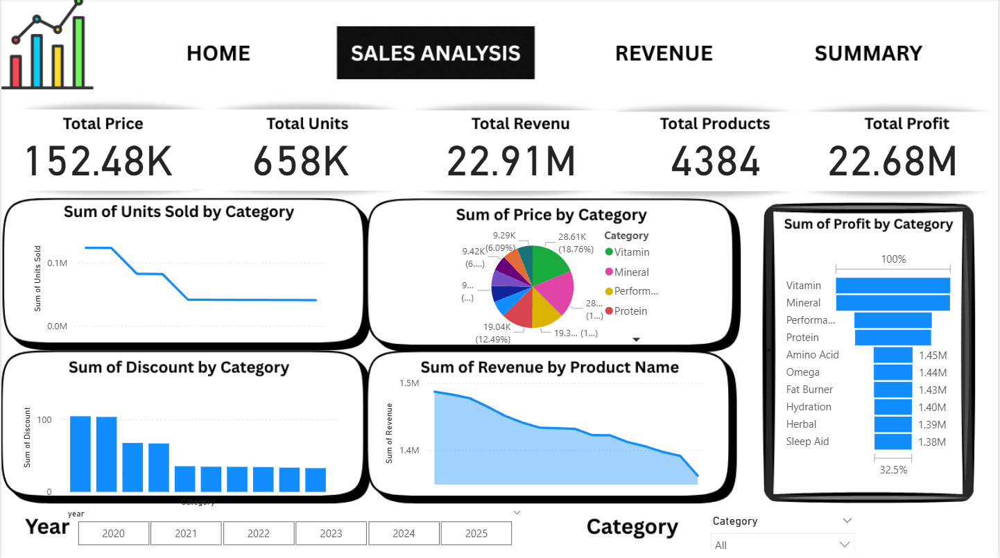

📊 Sales Analysis Dashboard

📌 Project Overview

The Sales Analysis Dashboard is a data visualization project designed to analyze sales performance, revenue, profit, and product trends across multiple years.
It provides a clear and interactive view of business performance, helping stakeholders understand what sells best, where revenue comes from, and how profit changes over time.

🎯 Objectives

Track overall sales, revenue, units sold, and profit

Identify top-performing products and categories

Analyze discount impact on sales

Compare platform-wise revenue

Understand year-wise sales trends

🏠 Home Page

High-level overview of business performance

Key KPIs:

Total Price

Total Units Sold

Total Revenue

Total Products

Quick snapshot for decision-makers

📈 Sales Analysis

Detailed analysis of sales performance

KPIs included:

Total Price

Total Units

Total Revenue

Total Products

Total Profit

Visualizations:

Units sold by category

Price distribution by category

Profit by category

Discount analysis

Revenue by product name

Interactive Year and Category filters

💰 Revenue Analysis

Revenue breakdown by:

Product category

Sales platform (Amazon, Walmart, iHerb, etc.)

Comparison of:

Revenue

Profit count

Units sold

Price

Helps identify most profitable platforms and categories

📊 Summary

Consolidated business metrics in one view

KPIs shown:

Total Price

Total Units

Total Revenue

Total Products

Total Profit

Highlights Top 5 Best Products for Each Year

Useful for management-level insights

🔍 Key Features

Interactive year and category slicers

Clean KPI cards for quick understanding

Bar charts, line charts, pie charts, and treemaps

User-friendly and professional dashboard design

🛠️ Tools & Technologies

Power BI – Data visualization and dashboard creation

Data Analysis – KPI calculation and aggregation

Excel / CSV – Data source (if applicable)

📷 Dashboard Screenshots

(Add your image file names exactly as in your repo)

🚀 Conclusion

This project demonstrates practical skills in data analysis, business intelligence, KPI tracking, and dashboard storytelling.
It is well-suited for Data Analyst and Business Analyst portfolios.
